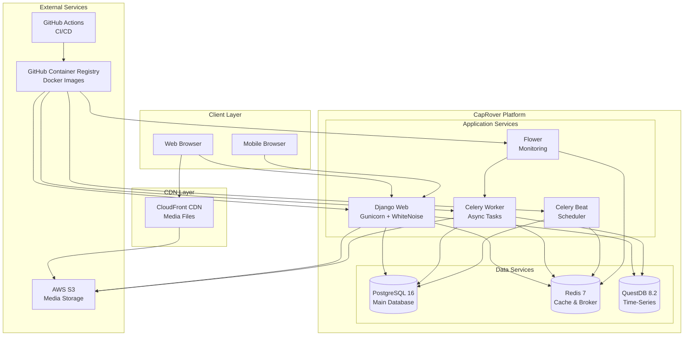
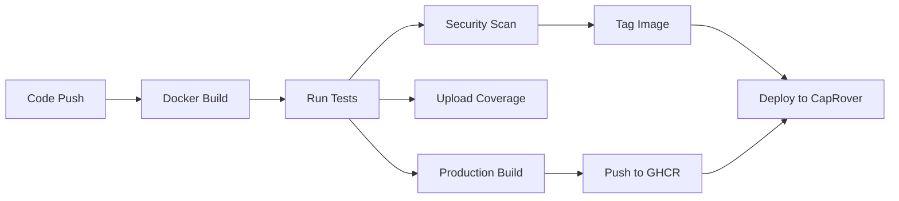
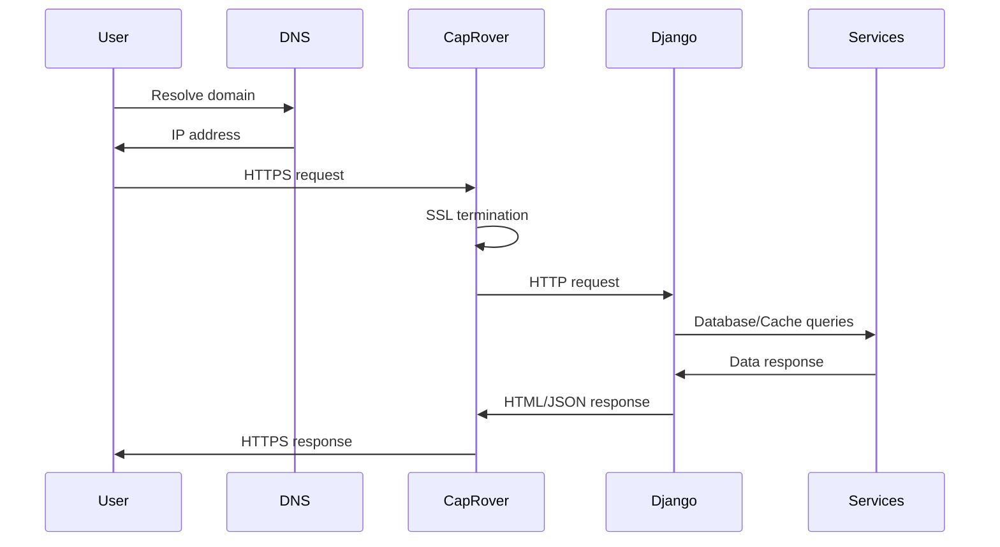
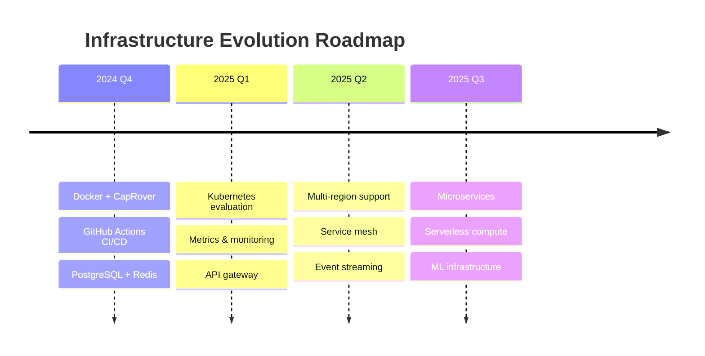

# Infrastructure Architecture

*Last Updated: November 2024*

This document provides a comprehensive overview of the infrastructure architecture for aaronspindler.com, including system design, service relationships, data flow, and deployment topology.

## Architecture Overview



## System Components

### Application Layer

#### Django Web Application
- **Container**: `ghcr.io/aaronspindler/aaronspindler.com-web`
- **Runtime**: Python 3.13 with Gunicorn
- **Workers**: 4 processes
- **Static Files**: WhiteNoise (served from container)
- **Health Check**: `/health/` endpoint
- **Features**:
  - Multi-domain support (aaronspindler.com, omas.coffee)
  - Full-text search with PostgreSQL
  - Knowledge graph visualization
  - Photo management with EXIF extraction
  - Request fingerprinting and analytics

#### Celery Worker
- **Container**: `ghcr.io/aaronspindler/aaronspindler.com-celery`
- **Pool**: Gevent with 200 concurrent workers
- **Broker**: Redis
- **Backend**: Redis
- **Tasks**:
  - Screenshot generation (Chromium)
  - Photo processing and resizing
  - Album ZIP generation
  - Email notifications
  - Geolocation processing
  - Search index rebuilding

#### Celery Beat Scheduler
- **Container**: `ghcr.io/aaronspindler/aaronspindler.com-celerybeat`
- **Scheduler**: DatabaseScheduler
- **Storage**: PostgreSQL
- **Periodic Tasks**:
  - Nightly Lighthouse audits
  - Request fingerprint geolocation
  - Cache cleanup
  - Search index updates
  - FeeFiFoFunds data ingestion

#### Flower Monitor
- **Container**: `ghcr.io/aaronspindler/aaronspindler.com-flower`
- **Port**: 5555
- **Features**:
  - Real-time task monitoring
  - Worker status tracking
  - Task history persistence
  - Optional basic authentication

### Data Layer

#### PostgreSQL 16
**Primary Database**
- **Purpose**: Main application data store
- **Features**:
  - Full-text search with pg_trgm
  - JSON field support
  - Unaccent extension for search
  - Optimized for Django ORM
- **Databases**:
  - `aaronspindler_db`: Production
  - `test_db`: CI/CD testing
- **Performance**:
  - Connection pooling: 200 max
  - Shared buffers: 256MB
  - Checkpoint optimization

#### Redis 7
**Cache & Message Broker**
- **Purpose**: Caching, sessions, Celery broker
- **Databases**:
  - DB 0: Django cache
  - DB 1: Celery broker
  - DB 2: Celery results
  - DB 3: Session storage
- **Persistence**: AOF enabled
- **Memory Policy**: allkeys-lru

#### QuestDB 8.2.1
**Time-Series Database**
- **Purpose**: FeeFiFoFunds market data
- **Ingestion**: 50K-100K records/sec
- **Protocols**:
  - REST API (port 9000)
  - PostgreSQL wire (port 8812)
  - InfluxDB line (port 9009)
- **Tables**:
  - Asset prices
  - Market indicators
  - Historical data
- **Optimization**:
  - Partitioned by day
  - Columnar storage
  - SQL query interface

### Storage Layer

#### Static Files (WhiteNoise)
**Container-Served Assets**
- **Location**: `/app/staticfiles/`
- **Content**: CSS, JavaScript, fonts, images
- **Optimization**:
  - Brotli/Gzip compression
  - Forever caching with versioned URLs
  - Critical CSS extraction
  - Minified JavaScript
- **Build Process**:
  - PostCSS with autoprefixer
  - PurgeCSS for unused styles
  - Terser for JS minification

#### Media Files (AWS S3)
**User-Generated Content**
- **Bucket**: Configured per environment
- **Content**: Photos, uploads, generated files
- **Features**:
  - Public read for media files
  - Private albums support
  - Multi-resolution images
  - CloudFront CDN distribution
- **Storage Classes**:
  - Standard: Recent uploads
  - Intelligent-Tiering: Older content

## Deployment Architecture

### CapRover Platform

**Platform Features**:
- Docker Swarm orchestration
- Automatic SSL with Let's Encrypt
- Zero-downtime deployments
- Built-in monitoring
- Multi-app support

**App Configuration**:
```yaml
Apps:
  - aaronspindler-web:
      domain: aaronspindler.com
      ssl: enabled
      healthcheck: /health/

  - aaronspindler-celery:
      instances: 2
      no-expose: true

  - aaronspindler-celerybeat:
      instances: 1
      no-expose: true

  - aaronspindler-flower:
      domain: flower.aaronspindler.com
      ssl: enabled
      basic-auth: enabled
```

### Container Registry (GHCR)

**Image Management**:
- **Registry**: `ghcr.io/aaronspindler`
- **Retention**: Latest 5 versions per service
- **Tagging Strategy**:
  - `latest`: Current production
  - `sha-{commit}`: Specific version
  - `v{version}`: Release tags
- **Cleanup**: Weekly automated cleanup

### CI/CD Pipeline

**GitHub Actions Workflow**:



**Pipeline Stages**:
1. **Build**: Docker image with BuildKit caching
2. **Test**: Django tests with full service stack
3. **Quality**: Linting, type checking, security scanning
4. **Package**: Multi-service production builds
5. **Deploy**: Automated CapRover deployment

## Network Architecture

### External Traffic Flow



### Internal Service Communication

**Service Discovery**:
- CapRover internal DNS
- Service names as hostnames
- Health check based routing

**Network Segmentation**:
- Application network
- Database network
- Cache network
- No external database exposure

## Security Architecture

### Container Security

**Build-Time Security**:
- Minimal base images (python:3.13-slim)
- No root user in production
- Secret scanning in CI/CD
- Vulnerability scanning with CodeQL

**Runtime Security**:
- Read-only root filesystem where possible
- Non-root user execution
- Resource limits enforced
- Network policies

### Application Security

**Django Security**:
```python
# Production settings
SECURE_SSL_REDIRECT = True
SESSION_COOKIE_SECURE = True
CSRF_COOKIE_SECURE = True
SECURE_BROWSER_XSS_FILTER = True
SECURE_CONTENT_TYPE_NOSNIFF = True
X_FRAME_OPTIONS = 'SAMEORIGIN'
```

**Authentication & Authorization**:
- Django authentication system
- Session-based auth
- CSRF protection
- Rate limiting on auth endpoints

### Infrastructure Security

**Network Security**:
- SSL/TLS encryption (Let's Encrypt)
- Firewall rules (ports 80, 443 only)
- DDoS protection via CloudFront
- Private database networks

**Secret Management**:
- GitHub Secrets for CI/CD
- CapRover environment variables
- No secrets in code or images
- Automated secret rotation

## Monitoring & Observability

### Health Monitoring

**Application Health**:
```python
# /health/ endpoint
{
  "status": "healthy",
  "version": "2024.11",
  "checks": {
    "database": true,
    "cache": true,
    "storage": true,
    "celery": true
  }
}
```

**Service Health Checks**:
- PostgreSQL: `pg_isready`
- Redis: `redis-cli ping`
- QuestDB: HTTP endpoint
- Celery: Worker heartbeat

### Performance Monitoring

**Lighthouse Audits**:
- Nightly automated runs
- Performance metrics tracking
- SEO score monitoring
- Accessibility compliance

**Application Metrics**:
- Request/response times
- Database query performance
- Cache hit rates
- Task execution times

### Logging

**Centralized Logging**:
- Application logs to stdout
- Container logs in CapRover
- Structured JSON logging
- Log rotation and retention

**Log Levels**:
```python
LOGGING = {
    'root': {'level': 'INFO'},
    'django': {'level': 'WARNING'},
    'celery': {'level': 'INFO'},
    'apps': {'level': 'DEBUG'},
}
```

## Scaling Strategy

### Horizontal Scaling

**Web Application**:
- Multiple Gunicorn workers
- CapRover app scaling
- Load balancer distribution
- Session affinity support

**Celery Workers**:
- Multiple worker containers
- Queue-based distribution
- Priority queue support
- Auto-scaling based on queue depth

### Vertical Scaling

**Resource Allocation**:
```yaml
Services:
  web:
    cpu: 2 cores
    memory: 2GB

  celery:
    cpu: 1 core
    memory: 1GB

  postgres:
    cpu: 2 cores
    memory: 4GB

  redis:
    cpu: 1 core
    memory: 512MB
```

### Database Scaling

**PostgreSQL Optimization**:
- Connection pooling
- Query optimization
- Index tuning
- Read replicas (future)

**QuestDB Optimization**:
- Partitioned tables
- Columnar storage
- Batch ingestion
- Query caching

## Disaster Recovery

### Backup Strategy

**Database Backups**:
- Daily PostgreSQL dumps
- 30-day retention
- S3 backup storage
- Point-in-time recovery

**Media Backups**:
- S3 versioning enabled
- Cross-region replication
- Lifecycle policies

### Recovery Procedures

**RTO/RPO Targets**:
- RTO: 4 hours
- RPO: 24 hours
- Automated restore scripts
- Documented procedures

## Performance Optimization

### Caching Strategy

**Cache Layers**:
1. **Browser Cache**: Static assets
2. **CDN Cache**: Media files
3. **Redis Cache**: Database queries
4. **Application Cache**: Computed values

**Cache Configuration**:
```python
CACHES = {
    'default': {
        'BACKEND': 'django_redis.cache.RedisCache',
        'LOCATION': 'redis://redis:6379/0',
        'OPTIONS': {
            'CLIENT_CLASS': 'django_redis.client.DefaultClient',
            'PARSER_CLASS': 'redis.connection.HiredisParser',
            'COMPRESSOR': 'django_redis.compressors.zlib.ZlibCompressor',
        }
    }
}
```

### Database Optimization

**Query Optimization**:
- Selective fetching with `select_related()`
- Bulk operations
- Database indexes
- Query result caching

**Connection Optimization**:
- Persistent connections
- Connection pooling
- Prepared statements

## Cost Optimization

### Resource Utilization

**Container Efficiency**:
- Multi-stage builds (~40% size reduction)
- Layer caching
- Shared base images
- Resource limits

**Service Optimization**:
- Scheduled scaling
- Idle resource cleanup
- Efficient task scheduling

### Infrastructure Costs

**Monthly Estimates**:
- CapRover Server: $20-40
- AWS S3: $5-10
- CloudFront: $5-10
- Domain/SSL: $0 (Let's Encrypt)
- Total: ~$30-60/month

## Future Architecture

### Planned Improvements

**Short Term (Q1 2025)**:
- Kubernetes migration evaluation
- Prometheus metrics integration
- Distributed tracing with OpenTelemetry
- GraphQL API layer

**Medium Term (Q2-Q3 2025)**:
- Multi-region deployment
- Database read replicas
- Event-driven architecture
- Service mesh implementation

**Long Term (2025+)**:
- Microservices decomposition
- Serverless functions for specific tasks
- ML model serving infrastructure
- Real-time WebSocket support

### Technology Roadmap



## Related Documentation

- [Docker & Containers](docker.md) - Container architecture details
- [CI/CD Pipeline](../features/ci-cd.md) - Build and deployment automation
- [Deployment Guide](../deployment.md) - Production deployment procedures
- [Maintenance Guide](../maintenance.md) - Operational procedures
- [Performance Monitoring](../features/performance-monitoring.md) - Monitoring setup
