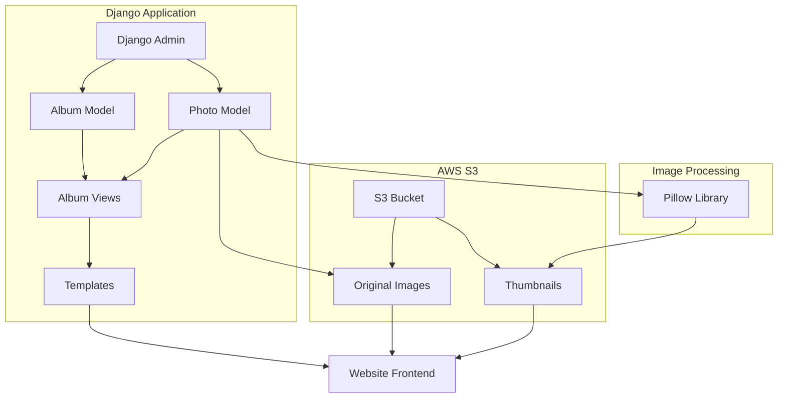

# Django Photo Gallery Architecture

## Overview
A minimalist photo gallery application for Django that integrates with AWS S3 for image storage, provides Django admin interface for management, and displays albums on the website's home page.

## 1. Database Schema Design

### Album Model
```python
class Album(models.Model):
    title = models.CharField(max_length=200)
    description = models.TextField(blank=True)
    cover_image = models.ImageField(upload_to='albums/covers/', null=True, blank=True)
    is_published = models.BooleanField(default=False)
    created_at = models.DateTimeField(auto_now_add=True)
    updated_at = models.DateTimeField(auto_now=True)
    order = models.IntegerField(default=0)  # For manual ordering in admin
    
    class Meta:
        ordering = ['-created_at']
```

### Photo Model
```python
class Photo(models.Model):
    album = models.ForeignKey(Album, on_delete=models.CASCADE, related_name='photos')
    title = models.CharField(max_length=200, blank=True)
    caption = models.TextField(blank=True)
    original_image = models.ImageField(upload_to='albums/photos/originals/')
    thumbnail = models.ImageField(upload_to='albums/photos/thumbnails/', blank=True)
    order = models.IntegerField(default=0)
    created_at = models.DateTimeField(auto_now_add=True)
    
    class Meta:
        ordering = ['order', '-created_at']
```

## 2. AWS S3 Configuration

### Bucket Structure
```
aaronspindler-media/
├── albums/
│   ├── covers/
│   │   └── {filename}
│   └── photos/
│       ├── originals/
│       │   └── {album_id}/{filename}
│       └── thumbnails/
│           └── {album_id}/{filename}_thumb.jpg
```

### CORS Configuration
```json
{
    "CORSRules": [
        {
            "AllowedHeaders": ["*"],
            "AllowedMethods": ["GET", "PUT", "POST"],
            "AllowedOrigins": ["https://aaronspindler.com", "http://localhost:8000"],
            "ExposeHeaders": ["ETag"],
            "MaxAgeSeconds": 3000
        }
    ]
}
```

### Bucket Policy
```json
{
    "Version": "2012-10-17",
    "Statement": [
        {
            "Sid": "PublicReadGetObject",
            "Effect": "Allow",
            "Principal": "*",
            "Action": "s3:GetObject",
            "Resource": "arn:aws:s3:::aaronspindler-media/*"
        }
    ]
}
```

## 3. Django Settings Configuration

### Storage Settings
```python
# AWS S3 Settings
AWS_ACCESS_KEY_ID = env('AWS_ACCESS_KEY_ID')
AWS_SECRET_ACCESS_KEY = env('AWS_SECRET_ACCESS_KEY')
AWS_STORAGE_BUCKET_NAME = 'aaronspindler-media'
AWS_S3_REGION_NAME = 'us-east-1'
AWS_S3_CUSTOM_DOMAIN = f'{AWS_STORAGE_BUCKET_NAME}.s3.amazonaws.com'
AWS_S3_OBJECT_PARAMETERS = {
    'CacheControl': 'max-age=86400',
}
AWS_DEFAULT_ACL = 'public-read'
AWS_S3_FILE_OVERWRITE = False
AWS_QUERYSTRING_AUTH = False

# Media files configuration
DEFAULT_FILE_STORAGE = 'photos.storage.MediaStorage'
MEDIA_URL = f'https://{AWS_S3_CUSTOM_DOMAIN}/'

# Thumbnail settings
THUMBNAIL_SIZE = (400, 400)
THUMBNAIL_QUALITY = 85
```

### Custom Storage Class
```python
# photos/storage.py
from django.conf import settings
from storages.backends.s3boto3 import S3Boto3Storage

class MediaStorage(S3Boto3Storage):
    bucket_name = settings.AWS_STORAGE_BUCKET_NAME
    custom_domain = settings.AWS_S3_CUSTOM_DOMAIN
    file_overwrite = False
```

## 4. Django Admin Configuration

### Album Admin
```python
@admin.register(Album)
class AlbumAdmin(admin.ModelAdmin):
    list_display = ['title', 'is_published', 'photo_count', 'created_at']
    list_filter = ['is_published', 'created_at']
    search_fields = ['title', 'description']
    ordering = ['-created_at']
    
    def photo_count(self, obj):
        return obj.photos.count()
    photo_count.short_description = 'Photos'
```

### Photo Admin
```python
@admin.register(Photo)
class PhotoAdmin(admin.ModelAdmin):
    list_display = ['title', 'album', 'thumbnail_preview', 'created_at']
    list_filter = ['album', 'created_at']
    search_fields = ['title', 'caption', 'album__title']
    autocomplete_fields = ['album']
    ordering = ['album', 'order']
    
    def thumbnail_preview(self, obj):
        if obj.thumbnail:
            return mark_safe(f'')
        return "No thumbnail"
    thumbnail_preview.short_description = 'Preview'
```

### Inline Admin
```python
class PhotoInline(admin.TabularInline):
    model = Photo
    extra = 1
    fields = ['title', 'caption', 'original_image', 'order']
    ordering = ['order']
```

## 5. URL Routing Structure

### Main URLs (config/urls.py)
```python
urlpatterns = [
    path("admin/", admin.site.urls),
    path("accounts/", include("allauth.urls")),
    path("photos/", include("photos.urls")),
    path("", include("pages.urls")),
]
```

### Photos URLs (photos/urls.py)
```python
urlpatterns = [
    path('albums/<int:album_id>/', views.album_detail, name='album_detail'),
]
```

## 6. View Architecture

### Album List (for home page)
```python
def get_published_albums():
    return Album.objects.filter(is_published=True).select_related().prefetch_related('photos')[:12]
```

### Album Detail View
```python
def album_detail(request, album_id):
    album = get_object_or_404(Album, id=album_id, is_published=True)
    photos = album.photos.all()
    return render(request, 'photos/album_detail.html', {
        'album': album,
        'photos': photos
    })
```

## 7. Template Structure

### Home Page Albums Section
```html
<!-- In templates/pages/home.html -->
<h2 id="photos">Photos</h2>
<div class="albums-grid">
    
    <div class="album-card">
        <a href="">
            
                
            
            <h3>{{ album.title }}</h3>
            <p>{{ album.photos.count }} photos</p>
        </a>
    </div>
    
</div>
```

### Album Detail Template
```html
<!-- templates/photos/album_detail.html -->


<div class="album-detail">
    <h1>{{ album.title }}</h1>
    <p>{{ album.description }}</p>
    <div class="photos-grid">
        
        <div class="photo-item">
            <a href="{{ photo.original_image.url }}" target="_blank">
                
            </a>
            
                <p>{{ photo.caption }}</p>
            
        </div>
        
    </div>
</div>

```

## 8. Environment Variables

Add to `.env`:
```
AWS_ACCESS_KEY_ID=your_access_key
AWS_SECRET_ACCESS_KEY=your_secret_key
AWS_STORAGE_BUCKET_NAME=aaronspindler-media
AWS_S3_REGION_NAME=us-east-1
```

## 9. Package Dependencies

Add to `requirements.txt`:
```
boto3==1.26.137
django-storages==1.13.2
Pillow==10.0.0
```

## 10. Thumbnail Generation Strategy

### Signal Handler for Automatic Thumbnail Generation
```python
# photos/signals.py
from django.db.models.signals import post_save
from django.dispatch import receiver
from PIL import Image
from io import BytesIO
from django.core.files.base import ContentFile

@receiver(post_save, sender=Photo)
def create_thumbnail(sender, instance, created, **kwargs):
    if created and instance.original_image and not instance.thumbnail:
        img = Image.open(instance.original_image)
        img.thumbnail((400, 400), Image.Resampling.LANCZOS)
        
        thumb_io = BytesIO()
        img.save(thumb_io, format='JPEG', quality=85)
        
        thumb_filename = f"{instance.original_image.name.split('.')[0]}_thumb.jpg"
        instance.thumbnail.save(thumb_filename, ContentFile(thumb_io.getvalue()), save=False)
        instance.save(update_fields=['thumbnail'])
```

## 11. Error Handling Strategy

### Upload Error Handling
- Implement try-catch blocks in admin save methods
- Log S3 upload failures to Django logging
- Display user-friendly error messages in admin
- Implement retry mechanism for failed uploads

### Missing Image Handling
- Use default placeholder images for missing thumbnails
- Gracefully handle S3 connection failures
- Cache S3 URLs to reduce API calls

## 12. CSS Styling (Minimal)

### Album Grid CSS
```css
/* static/css/photos.css */
.albums-grid {
    display: grid;
    grid-template-columns: repeat(auto-fill, minmax(250px, 1fr));
    gap: 20px;
    margin: 20px 0;
}

.album-card {
    border: 1px solid #ddd;
    padding: 10px;
}

.album-card img {
    width: 100%;
    height: 200px;
    object-fit: cover;
}

.photos-grid {
    display: grid;
    grid-template-columns: repeat(auto-fill, minmax(200px, 1fr));
    gap: 15px;
}

.photo-item img {
    width: 100%;
    height: auto;
}
```

## 13. Performance Optimizations

### Database Optimizations
- Use `select_related()` and `prefetch_related()` for album queries
- Add database indexes on frequently queried fields
- Implement pagination for albums with many photos

### S3 Optimizations
- Use CloudFront CDN for faster global delivery
- Implement browser caching headers
- Use lazy loading for images
- Consider WebP format for better compression

## 14. Security Considerations

### S3 Security
- Use IAM roles with minimal required permissions
- Enable S3 versioning for backup
- Implement S3 lifecycle policies for old images
- Use secure URLs for private content if needed

### Django Security
- Validate image file types and sizes
- Implement rate limiting for uploads
- Use CSRF protection for all forms
- Sanitize user input in captions and titles

## 15. Migration Strategy

1. Add photos app to INSTALLED_APPS
2. Run migrations to create database tables
3. Configure AWS credentials
4. Create S3 bucket with proper permissions
5. Test upload functionality in development
6. Deploy to production with environment variables
7. Verify S3 connectivity and permissions

## Mermaid Diagram - System Architecture



## Implementation Priority

1. **Phase 1 - Core Models & Admin** (Tasks 1, 6, 7)
2. **Phase 2 - S3 Integration** (Tasks 2, 3, 4, 11)
3. **Phase 3 - Image Processing** (Task 5)
4. **Phase 4 - Frontend Display** (Tasks 8, 9, 10)
5. **Phase 5 - Testing & Deployment** (Tasks 12, 13, 14, 15)

This architecture provides a solid foundation for a minimalist photo gallery that is easy to maintain and scale.